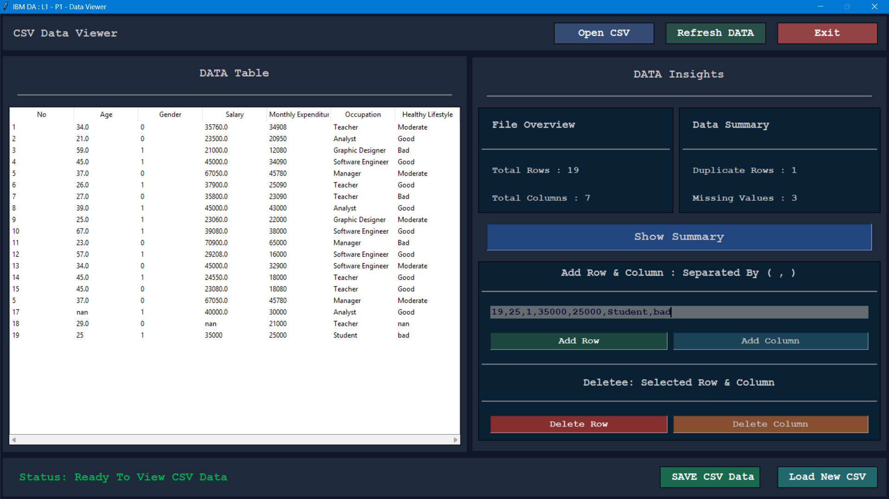

# 🚀 Advanced CSV Data Analyzer & Data Viewer (Python GUI)

An advanced and interactive CSV Data Analyzer Desktop Application built
using Python, Tkinter, Pandas, and NumPy.

This application provides a real-world data handling experience with a
modern GUI, dynamic data operations, and insightful data summaries ---
all without writing code. 💡

------------------------------------------------------------------------

## 📌 📖 Project Overview

This project allows users to load, view, analyze, and modify CSV data
through an intuitive graphical interface.

It is designed to simulate real-world data analysis workflows with clean
UI, smart controls, and interactive features --- making it ideal for
both beginners and intermediate developers.

------------------------------------------------------------------------

## 🔥 Why This Project Stands Out

Unlike basic CSV viewers, this application offers:

✔ Real-time data manipulation     
✔ Integrated data insights panel     
✔ GUI-based data editing (no coding required)     
✔ Structured and modern UI layout     
✔ Practical features used in real-world tools   

------------------------------------------------------------------------

## 🖥️ GUI Highlights

-   📊 Data Table Viewer
    -   Displays CSV data in structured table format
    -   Scrollable and responsive layout
      
-   📈 Data Insights Panel
    -   File Overview:
        -   Total Rows
        -   Total Columns
    -   Data Summary:
        -   Missing Values
        -   Duplicate Rows
        
-   ⚙️ Action Controls
    -   Open CSV
    -   Refresh Data
    -   Load New CSV
    -   Save CSV Data
    
-   ✏️ Data Modification
    -   Add Row (comma-separated input)
    -   Add Column
    -   Delete Selected Row
    -   Delete Selected Column
    
-   📊 Summary Button
    -   Instantly generates dataset insights

------------------------------------------------------------------------

## 🛠️ Tech Stack

| Technology | Purpose              |
| ---------- | -------------------- |
| 🐍 Python  | Core Programming     |
| 🖼️ Tkinter | GUI Development      |
| 🐼 Pandas  | Data Handling        |
| 🔢 NumPy   | Numerical Operations |

------------------------------------------------------------------------

## ✨ Key Features

-   📂 Load and display CSV files
-   📊 Interactive data table using Treeview
-   ➕ Add rows using comma-separated values
-   ➕ Add new columns dynamically
-   ❌ Delete selected rows and columns
-   🔄 Refresh dataset instantly
-   💾 Save modified CSV file
-   📊 Real-time data insights:
    -   Total rows & columns
    -   Missing values
    -   Duplicate records
-   ⚠️ Smart error handling & alerts
-   🎯 Clean, modern, and user-friendly UI
-   ⚡ Fast and responsive performance

------------------------------------------------------------------------

## 🖥️ GUI Preview



------------------------------------------------------------------------

## ▶️ How to Run

### 1️⃣ Install required libraries

``` bash
pip install pandas numpy
```

⚠️ Tkinter usually comes pre-installed with Python

### 2️⃣ Run the application

``` bash
python main.py
```

------------------------------------------------------------------------

## 📊 Example Use Cases

✔ Data cleaning before analysis
✔ CSV editing without Excel
✔ GUI-based data handling tool
✔ Learning real-world data workflows
✔ Portfolio project for students

------------------------------------------------------------------------

## 💡 Learning Outcomes

📌 Advanced Tkinter GUI design
📌 Treeview data handling
📌 Real-time DataFrame updates
📌 Data analysis using Pandas
📌 GUI + Data integration

------------------------------------------------------------------------

## 🚀 Future Improvements

🔹 Search & filter functionality
🔹 Column sorting
🔹 Data visualization (charts & graphs)
🔹 Export to Excel format
🔹 Dark/Light theme toggle

------------------------------------------------------------------------

## 👨‍💻 Author

Harsh Chaudhary\
India 🇮🇳

------------------------------------------------------------------------

## ⭐ Support

If you found this project useful, consider giving it a ⭐ on GitHub!
